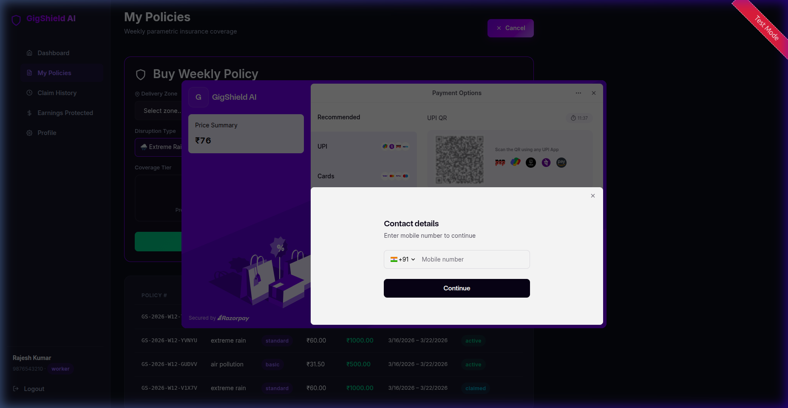
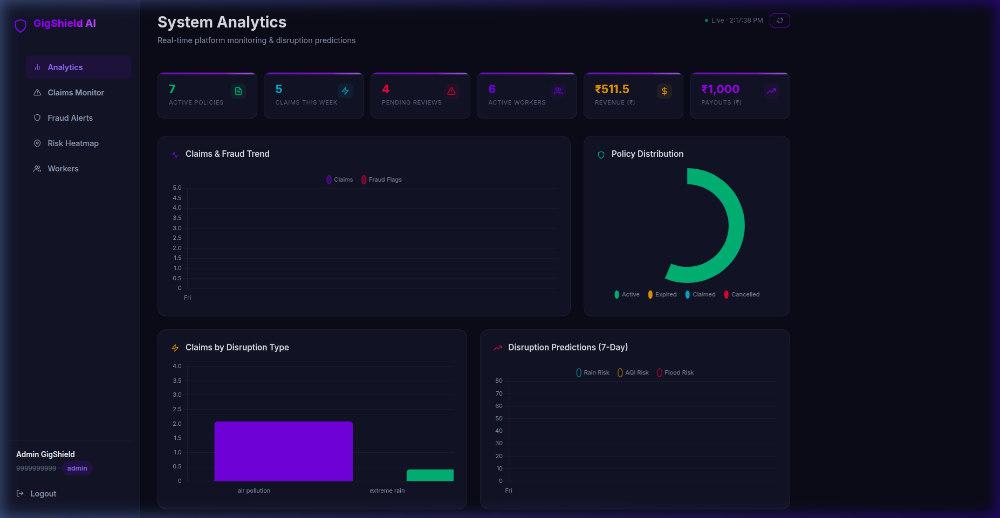
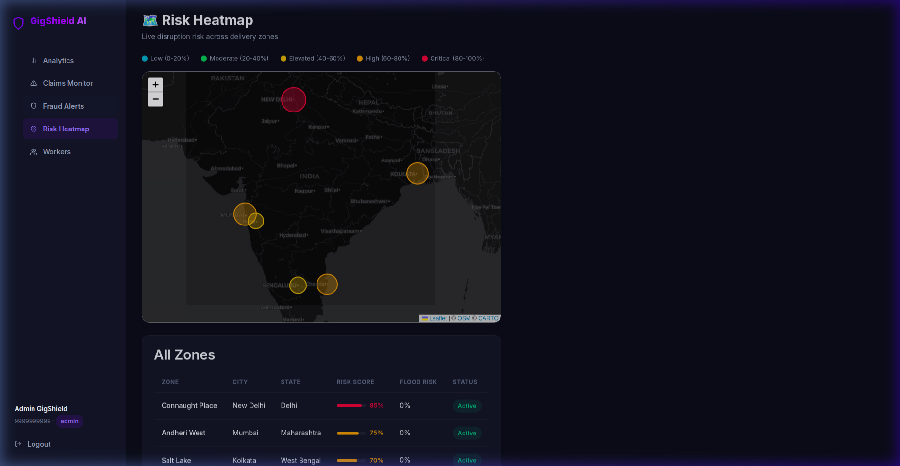
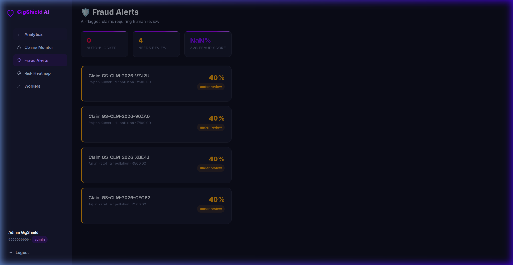

<div align="center">

# 🛡️ GigShield AI

### AI-Powered Parametric Insurance Platform for Gig Delivery Workers in India
**Official Submission for DEVTrails 2026 — Seed Phase 1**

[](LICENSE.md)
[](https://nodejs.org)
[](https://python.org)
[](https://react.dev)
[](https://postgresql.org)
[](https://razorpay.com)

*Protecting 8M+ delivery partners from income loss caused by extreme weather, AQI, and curfews — powered by real-time environmental APIs and AI fraud detection.*

[Architecture](#architecture) • [Features](#key-features) • [Installation](#-quick-start) • [Demo](#-live-demonstration) • [Setup Guide](docs/SETUP.md)

</div>

---

## 📋 The Problem
India's gig workers lose up to **30% of their weekly earnings** due to events beyond their control: torrential rain, hazardous air pollution (AQI > 400), and municipal curfews. Traditional insurance requires manual filing, documentation, and weeks of processing—proving impossible for a worker missing a single day's wage.

## 🚀 The Solution: GigShield AI
GigShield AI is a **zero-touch parametric insurance platform**. 
- **Auto-Triggered Claims**: Our engine monitors WAQI and OpenWeatherMap APIs. If a threshold is hit, claims are created automatically.
- **Instant Payouts**: Verified claims are disbursed instantly via **RazorpayX** to the worker's UPI ID.
- **Affordable Weekly Premiums**: Micropayments (₹30-₹120) tailored to gig pay cycles.
- **AI Sentinel**: An Isolation Forest AI model scores every claim for fraud in real-time.

---

## ✨ Key Features

### 👷 For Workers
- **One-Click Protection**: Buy weekly coverage for specific disruptions (Rain, Heat, AQI).
- **Live Razorpay SDK**: Real-time premium collection with UPI, Card, and Netbanking support.
- **Virtual Wallet**: Track every premium paid and claim received in a glassmorphism ledger.

### 🛡️ For Administrators
- **Risk Heatmap**: Live Leaflet.js map showing disruption risks across major Indian metros.
- **Trigger Engine Control**: "Force Env Scan" button to manually sync with weather satellites.
- **Fraud Command Center**: AI-flagged claims are listed for human-in-the-loop verification.
- **Data Export**: One-click CSV export for all claims and financial records.

---

## 🏗️ Technical Stack

- **Frontend**: React 19, Vite, Chart.js, Leaflet, Framer Motion.
- **Backend**: Node.js 22, Express, Razorpay SDK, PostgreSQL 16.
- **AI Microservices**: Python 3.12, FastAPI, Scikit-learn (Random Forest & Isolation Forest).
- **Infrastructure**: Docker Compose (7-service microservice mesh), Redis 7 (Caching).

---

## 🚀 Quick Start

### Docker (Recommended)
GigShield AI is fully containerized. Deploy the entire stack with one command:

```bash
git clone https://github.com/dkv204p/GigShield-AI.git
cd GigShield-AI
docker compose up --build -d
```

### Accessing the Platform
- **Frontend Dashboard**: [http://localhost](http://localhost)
- **Admin Login**: `9999999999` / `admin123`
- **Worker Login**: `9876543210` / `worker123`

---

## 🖼️ Visual Experience

````carousel

<!-- slide -->

<!-- slide -->

<!-- slide -->

````

### 🎬 Demo Walkthrough


---

## 🎬 Live Demonstration
To test the "Parametric Trigger" logic immediately:
1. Log in as **Admin**.
2. Go to **Claims Monitor**.
3. Click **"Force Env Scan"**.
4. The system will fetch real-time weather/AQI for major metros. If values are hazardous, you will see claims populate instantly in the dashboard!

*(For detailed troubleshooting and manual setup, see [SETUP.md](docs/SETUP.md))*

---

## 📄 License
This project is licensed under the MIT License — see the [LICENSE.md](LICENSE.md) file for details.

<div align="center">

**Empowering the backbone of India's digital economy.**  
Made with ❤️ for the Gig Community.

</div>
