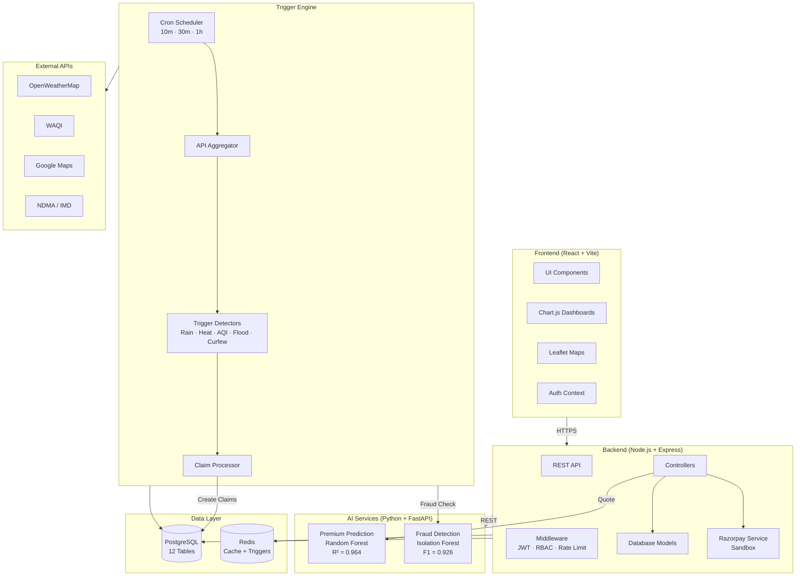
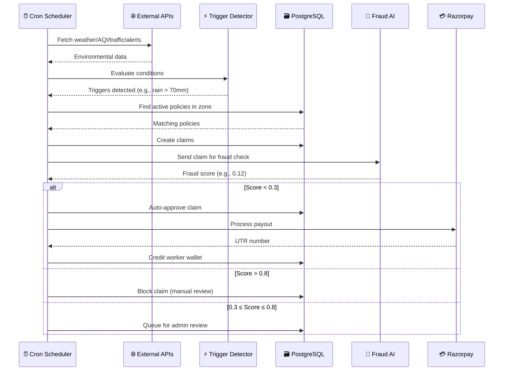
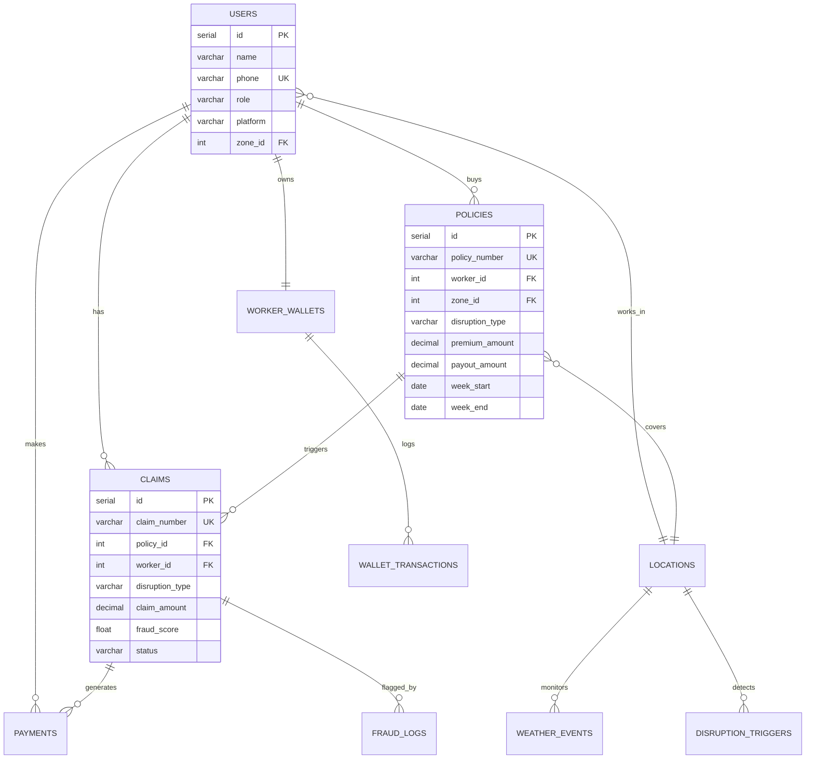

# GigShield AI — System Architecture

## High-Level Architecture



---

## Service Breakdown

### 1. React Frontend (Port 5173 / 80)

| Component | Purpose |
|---|---|
| `AuthContext` | JWT token management, role detection |
| `Layout` | Sidebar navigation (worker vs admin) |
| `usePolling` | Real-time data refresh (20–30s intervals) |
| `chartConfig` | Chart.js dark theme + gradient factories |
| Worker Pages | Dashboard, Policies, Claims, Earnings |
| Admin Pages | Analytics, Claims Monitor, Fraud Alerts, Heatmap, Workers |

### 2. Express Backend (Port 5000)

| Module | Endpoints | Description |
|---|---|---|
| Auth | 4 | Register, Login, JWT refresh, Profile |
| Users | 4 | Profile CRUD, Zone selection, KYC |
| Policies | 5 | Create, Quote, Active, List, Cancel |
| Claims | 4 | List, Detail, Review, Pending |
| Payments | 6 | Premium, Payout, Wallet, History, Revenue, Webhook |
| Admin | 7 | Overview, Workers, Policies, Claims, Risk, Zones |

### 3. Premium AI (Port 8001)

```
Input (17 features) → StandardScaler → Random Forest (200 trees) → Weekly Premium ₹
```

Features: location coordinates, rainfall history, flood risk, AQI levels, traffic congestion, delivery density, worker experience, platform, seasonal factors.

### 4. Fraud AI (Port 8002)

```
Input (20 features) → Preprocessing → Ensemble
                                        ├── Isolation Forest (35%)
                                        ├── LOF (25%)
                                        └── Rule Engine (40%)
                                        → Fraud Score [0, 1]
```

Rules: GPS spoofing, impossible speed, device/IP anomaly, claim frequency, policy gaming, timing anomaly.

### 5. Trigger Engine (Background)

```
Scheduler → API Aggregator → Trigger Detectors → Claim Processor
   │                │                │                  │
   │       ┌────────┼────────┐      │           ┌──────┼──────┐
   │       │        │        │      │           │      │      │
  Cron   Weather   AQI   Traffic  5 Rules    Create  Fraud  Payout
 10/30m   API      API    API    Evaluators  Claim   Check  Simulate
```

---

## Data Flow

### Claim Auto-Processing Pipeline



---

## Database Schema (12 Tables)


